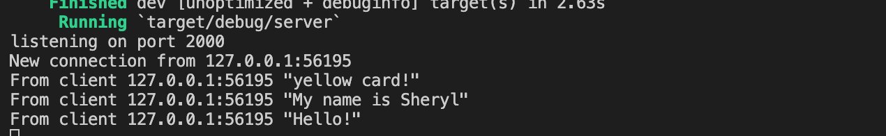
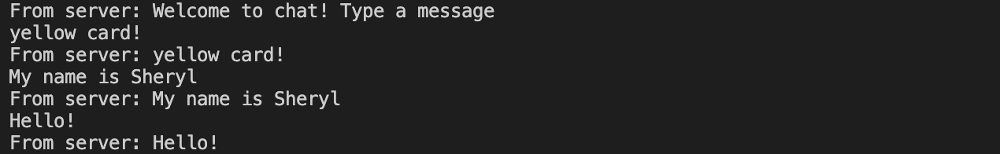
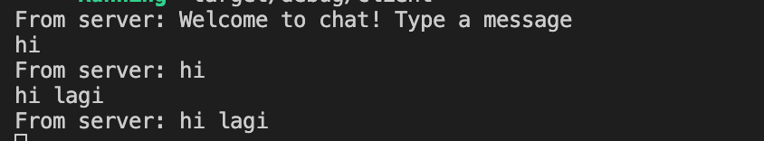
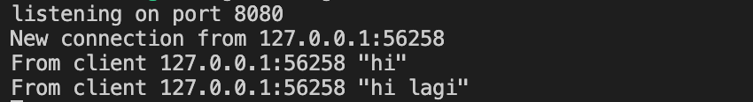
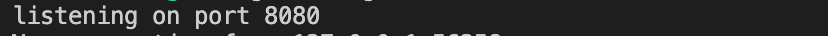
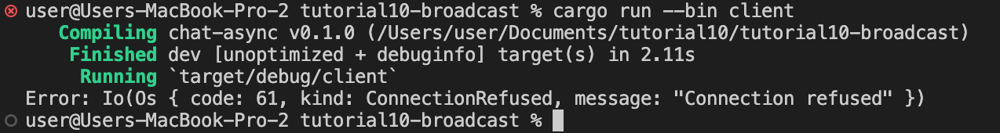

# Tutorial10 BROADCAST
Nama: Sheryl Ivana Widjaja 
NPM: 2206824943 
Kelas: Pemrograman Lanjut - A 

## REFLEKSI 2

###### 2.1. Original code of broadcast chat.
  

* Server dapat dijalankan menggunakan perintah `cargo run --bin server`, sementara setiap klien dapat dijalankan menggunakan perintah `cargo run --bin client`.
* Setiap klien dan server menerima *broadcast* dari semua klien lainnya. Ketika seorang klien memasukkan pesan melalui baris perintah, pesan tersebut akan dikirimkan ke server.
* Server kemudian akan meneruskan pesan tersebut ke semua klien yang terhubung. Dengan demikian, setiap klien akan menerima pesan dari klien lainnya melalui server. Semua pesan yang dimasukkan oleh klien akan didistribusikan kepada semua klien yang terhubung ke server.

 
###### 2.2. Modifying the websocket port.
* Ketika port yang digunakan oleh klien dan server adalah sama, aplikasi akan tetap berjalan dengan baik seperti sebelumnya, seperti yang ditunjukkan dalam gambar di atas.
  

Jika hanya satu dari kedua port tersebut yang diubah, misalnya port klien, maka akan terjadi kesalahan pada sisi klien. Klien akan menganggap bahwa port yang diubah tersebut tidak terhubung, dan program akan gagal ketika perintah `cargo run --bin client` dijalankan, seperti yang ditunjukkan dalam gambar di atas.
  
